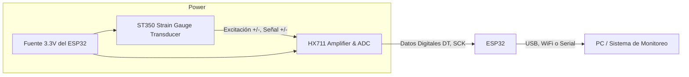

# Diseño de conexión inalámbrica

Para la conexión de las glagas extensiométricas se pretende utilizar un ESP32 junto a un HX711 para tener mejor presición en la toma de datos. 

En el siguiente diagrama se muestra como estos deben conectarse

    ST350         HX711
    +EXC  ------> E+  
    −EXC  ------> E-  
    +SIG  ------> A+  
    −SIG  ------> A-  

    HX711 VCC ---> 3.3V del ESP32  
    HX711 GND ---> GND del ESP32  
    HX711 DT  ---> GPIO21 (por ejemplo)  
    HX711 SCK ---> GPIO22 (por ejemplo)
