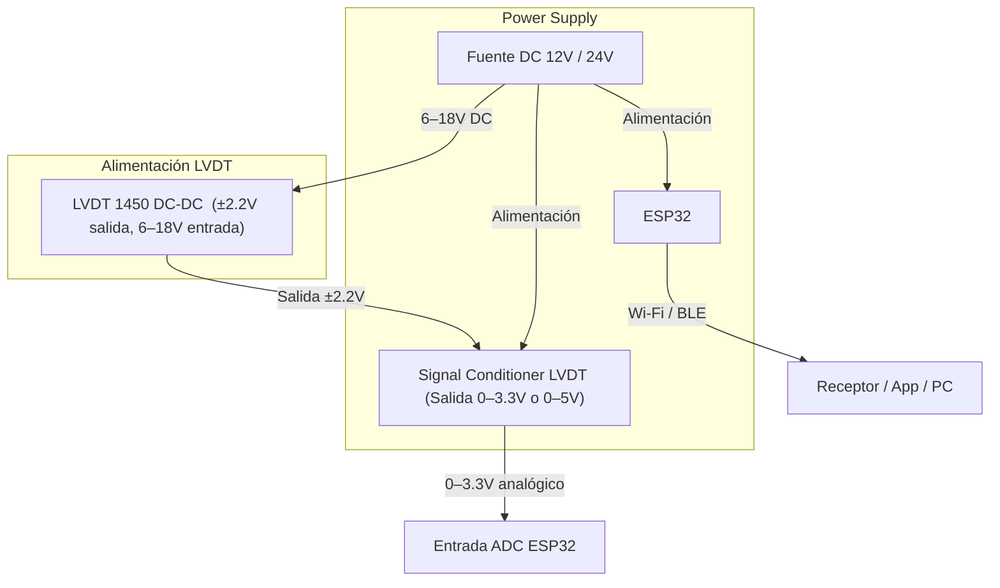

# Diagrama de conexión inalámbrica

```mermaid
flowchart TB
    subgraph Power Supply
        PSU[Fuente DC 12V / 24V] --> |Alimentación| COND
        PSU --> |Alimentación| ESP[ESP32]
    end

    LVDT["LVDT 1450 DC-DC  (±2.2V salida, 6–18V entrada)"] --> |"Salida ±2.2V"| COND["Signal Conditioner LVDT (Salida 0–3.3V o 0–5V)"]

    COND --> |"0–3.3V analógico"| ADC[Entrada ADC ESP32]

    ESP --> |"Wi-Fi / BLE"| CLOUD[Receptor / App / PC]

    subgraph Alimentación LVDT
        PSU --> |"6–18V DC"| LVDT
    end
```